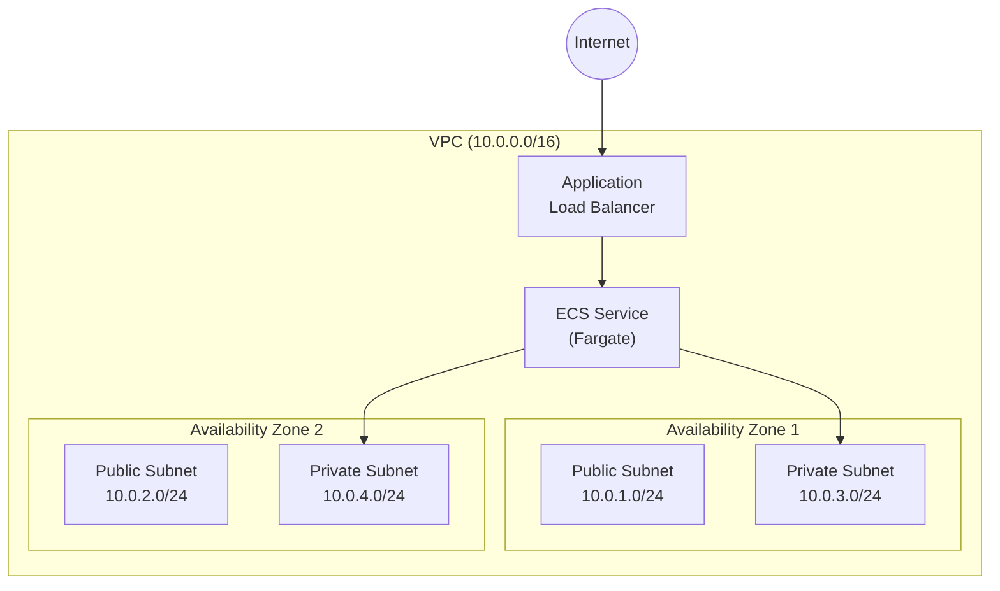

# Deploy OWASP Juice Shop on AWS ECS (Step-by-Step Guide)

This guide provides step-by-step instructions for deploying the OWASP Juice Shop application onto AWS ECS using Fargate.

---

## Prerequisites

Before starting, ensure you have:

- [ ] **AWS Account** with appropriate IAM permissions
- [ ] **AWS CLI v2** installed and configured (`aws configure`)
- [ ] Basic understanding of AWS networking and containers

### Required IAM Permissions
```
- AmazonECS_FullAccess
- AmazonEC2FullAccess (for VPC/Security Groups)
- ElasticLoadBalancingFullAccess
- IAMFullAccess (for creating ECS Task Execution Role)
- AmazonEC2ContainerRegistryReadOnly
```

---

## Architecture Overview



---

## Step 1: Create VPC and Networking

### Option A: Using AWS Console

1. Navigate to **VPC Dashboard** → **Create VPC**
2. Select **VPC and more** (wizard)
3. Configure:
   - **Name tag**: `juice-shop-vpc`
   - **IPv4 CIDR**: `10.0.0.0/16`
   - **Number of Availability Zones**: `2`
   - **Number of public subnets**: `2`
   - **Number of private subnets**: `2`
   - **NAT gateways**: `In 1 AZ` (for cost savings) or `1 per AZ` (for high availability)
   - **VPC endpoints**: None
4. Click **Create VPC**

### Option B: Using AWS CLI

```bash
# Set variables
export AWS_REGION="ap-southeast-1"
export VPC_NAME="juice-shop-vpc"

# Create VPC
VPC_ID=$(aws ec2 create-vpc \
    --cidr-block 10.0.0.0/16 \
    --tag-specifications "ResourceType=vpc,Tags=[{Key=Name,Value=$VPC_NAME}]" \
    --query 'Vpc.VpcId' \
    --output text)

echo "VPC ID: $VPC_ID"

# Enable DNS hostnames
aws ec2 modify-vpc-attribute \
    --vpc-id $VPC_ID \
    --enable-dns-hostnames

# Create Internet Gateway
IGW_ID=$(aws ec2 create-internet-gateway \
    --tag-specifications "ResourceType=internet-gateway,Tags=[{Key=Name,Value=juice-shop-igw}]" \
    --query 'InternetGateway.InternetGatewayId' \
    --output text)

# Attach Internet Gateway to VPC
aws ec2 attach-internet-gateway \
    --internet-gateway-id $IGW_ID \
    --vpc-id $VPC_ID

# Create Public Subnets
PUBLIC_SUBNET_1=$(aws ec2 create-subnet \
    --vpc-id $VPC_ID \
    --cidr-block 10.0.1.0/24 \
    --availability-zone ${AWS_REGION}a \
    --tag-specifications "ResourceType=subnet,Tags=[{Key=Name,Value=juice-shop-public-1}]" \
    --query 'Subnet.SubnetId' \
    --output text)

PUBLIC_SUBNET_2=$(aws ec2 create-subnet \
    --vpc-id $VPC_ID \
    --cidr-block 10.0.2.0/24 \
    --availability-zone ${AWS_REGION}b \
    --tag-specifications "ResourceType=subnet,Tags=[{Key=Name,Value=juice-shop-public-2}]" \
    --query 'Subnet.SubnetId' \
    --output text)

# Enable auto-assign public IP for public subnets
aws ec2 modify-subnet-attribute \
    --subnet-id $PUBLIC_SUBNET_1 \
    --map-public-ip-on-launch

aws ec2 modify-subnet-attribute \
    --subnet-id $PUBLIC_SUBNET_2 \
    --map-public-ip-on-launch

# Create Route Table for public subnets
PUBLIC_RT=$(aws ec2 create-route-table \
    --vpc-id $VPC_ID \
    --tag-specifications "ResourceType=route-table,Tags=[{Key=Name,Value=juice-shop-public-rt}]" \
    --query 'RouteTable.RouteTableId' \
    --output text)

# Add route to Internet Gateway
aws ec2 create-route \
    --route-table-id $PUBLIC_RT \
    --destination-cidr-block 0.0.0.0/0 \
    --gateway-id $IGW_ID

# Associate public subnets with route table
aws ec2 associate-route-table --subnet-id $PUBLIC_SUBNET_1 --route-table-id $PUBLIC_RT
aws ec2 associate-route-table --subnet-id $PUBLIC_SUBNET_2 --route-table-id $PUBLIC_RT

echo "Public Subnet 1: $PUBLIC_SUBNET_1"
echo "Public Subnet 2: $PUBLIC_SUBNET_2"
```

---

## Step 2: Create Security Groups

### Option A: Using AWS Console

1. Navigate to **EC2 Dashboard** → **Security Groups**
2. Click **Create security group**

#### ALB Security Group
- **Name**: `juice-shop-alb-sg`
- **VPC**: Select `juice-shop-vpc`
- **Inbound Rules**:
  | Type | Port | Source | Description |
  |------|------|--------|-------------|
  | HTTP | 80 | 0.0.0.0/0 | Allow HTTP from Internet |
  | HTTPS | 443 | 0.0.0.0/0 | Allow HTTPS from Internet |

#### ECS Tasks Security Group
- **Name**: `juice-shop-ecs-sg`
- **VPC**: Select `juice-shop-vpc`
- **Inbound Rules**:
  | Type | Port | Source | Description |
  |------|------|--------|-------------|
  | Custom TCP | 3000 | juice-shop-alb-sg | Allow from ALB only |

### Option B: Using AWS CLI

```bash
# Create ALB Security Group
ALB_SG=$(aws ec2 create-security-group \
    --group-name juice-shop-alb-sg \
    --description "Security group for Juice Shop ALB" \
    --vpc-id $VPC_ID \
    --query 'GroupId' \
    --output text)

# Add inbound rules for ALB
aws ec2 authorize-security-group-ingress \
    --group-id $ALB_SG \
    --protocol tcp \
    --port 80 \
    --cidr 0.0.0.0/0

aws ec2 authorize-security-group-ingress \
    --group-id $ALB_SG \
    --protocol tcp \
    --port 443 \
    --cidr 0.0.0.0/0

# Create ECS Tasks Security Group
ECS_SG=$(aws ec2 create-security-group \
    --group-name juice-shop-ecs-sg \
    --description "Security group for Juice Shop ECS Tasks" \
    --vpc-id $VPC_ID \
    --query 'GroupId' \
    --output text)

# Allow traffic from ALB to ECS tasks on port 3000
aws ec2 authorize-security-group-ingress \
    --group-id $ECS_SG \
    --protocol tcp \
    --port 3000 \
    --source-group $ALB_SG

echo "ALB Security Group: $ALB_SG"
echo "ECS Security Group: $ECS_SG"
```

---

## Step 3: Create ECS Cluster

### Option A: Using AWS Console

1. Navigate to **Amazon ECS** → **Clusters**
2. Click **Create cluster**
3. Configure:
   - **Cluster name**: `juice-shop-cluster`
   - **Infrastructure**: Select **AWS Fargate (serverless)**
4. Click **Create**

### Option B: Using AWS CLI

```bash
# Create ECS Cluster
aws ecs create-cluster \
    --cluster-name juice-shop-cluster \
    --capacity-providers FARGATE FARGATE_SPOT \
    --default-capacity-provider-strategy capacityProvider=FARGATE,weight=1

echo "ECS Cluster created: juice-shop-cluster"
```

---

## Step 4: Create IAM Role for ECS Task Execution

### Option A: Using AWS Console

1. Navigate to **IAM** → **Roles**
2. Click **Create role**
3. Select:
   - **Trusted entity type**: AWS Service
   - **Use case**: Elastic Container Service → Elastic Container Service Task
4. Attach policy: `AmazonECSTaskExecutionRolePolicy`
5. **Role name**: `ecsTaskExecutionRole`
6. Click **Create role**

### Option B: Using AWS CLI

```bash
# Create trust policy document
cat > trust-policy.json << 'EOF'
{
  "Version": "2012-10-17",
  "Statement": [
    {
      "Effect": "Allow",
      "Principal": {
        "Service": "ecs-tasks.amazonaws.com"
      },
      "Action": "sts:AssumeRole"
    }
  ]
}
EOF

# Create the role
aws iam create-role \
    --role-name ecsTaskExecutionRole \
    --assume-role-policy-document file://trust-policy.json

# Attach the policy
aws iam attach-role-policy \
    --role-name ecsTaskExecutionRole \
    --policy-arn arn:aws:iam::aws:policy/service-role/AmazonECSTaskExecutionRolePolicy

# Get the role ARN
EXECUTION_ROLE_ARN=$(aws iam get-role \
    --role-name ecsTaskExecutionRole \
    --query 'Role.Arn' \
    --output text)

echo "Execution Role ARN: $EXECUTION_ROLE_ARN"

# Clean up temp file
rm trust-policy.json
```

---

## Step 5: Create ECS Task Definition

### Option A: Using AWS Console

1. Navigate to **Amazon ECS** → **Task definitions**
2. Click **Create new task definition**
3. Configure:

#### Task definition configuration
| Setting | Value |
|---------|-------|
| Task definition family | `juice-shop-task` |
| Launch type | `AWS Fargate` |
| Operating system/Architecture | `Linux/X86_64` |
| Task size - CPU | `0.5 vCPU` |
| Task size - Memory | `1 GB` |
| Task execution role | `ecsTaskExecutionRole` |

#### Container configuration
| Setting | Value |
|---------|-------|
| Name | `juice-shop` |
| Image URI | `bkimminich/juice-shop:latest` |
| Essential container | Yes |
| Port mappings | Container port: `3000`, Protocol: `TCP` |

#### Health check (optional but recommended)
| Setting | Value |
|---------|-------|
| Command | `CMD-SHELL, curl -f http://localhost:3000/rest/admin/application-version \|\| exit 1` |
| Interval | `30` |
| Timeout | `5` |
| Start period | `60` |
| Retries | `3` |

#### Environment variables
| Key | Value |
|-----|-------|
| NODE_ENV | `production` |

4. Click **Create**

### Option B: Using AWS CLI

```bash
# Get AWS Account ID
AWS_ACCOUNT_ID=$(aws sts get-caller-identity --query Account --output text)

# Create task definition JSON
cat > task-definition.json << EOF
{
    "family": "juice-shop-task",
    "networkMode": "awsvpc",
    "requiresCompatibilities": ["FARGATE"],
    "cpu": "512",
    "memory": "1024",
    "executionRoleArn": "arn:aws:iam::${AWS_ACCOUNT_ID}:role/ecsTaskExecutionRole",
    "containerDefinitions": [
        {
            "name": "juice-shop",
            "image": "bkimminich/juice-shop:latest",
            "essential": true,
            "portMappings": [
                {
                    "containerPort": 3000,
                    "protocol": "tcp"
                }
            ],
            "environment": [
                {
                    "name": "NODE_ENV",
                    "value": "production"
                }
            ],
            "healthCheck": {
                "command": ["CMD-SHELL", "curl -f http://localhost:3000/rest/admin/application-version || exit 1"],
                "interval": 30,
                "timeout": 5,
                "retries": 3,
                "startPeriod": 60
            },
            "logConfiguration": {
                "logDriver": "awslogs",
                "options": {
                    "awslogs-group": "/ecs/juice-shop",
                    "awslogs-region": "${AWS_REGION}",
                    "awslogs-stream-prefix": "ecs",
                    "awslogs-create-group": "true"
                }
            }
        }
    ]
}
EOF

# Register task definition
aws ecs register-task-definition \
    --cli-input-json file://task-definition.json

echo "Task definition created: juice-shop-task"

# Clean up
rm task-definition.json
```

---

## Step 6: Create Application Load Balancer

### Option A: Using AWS Console

1. Navigate to **EC2** → **Load Balancers**
2. Click **Create load balancer** → **Application Load Balancer**

#### Basic configuration
| Setting | Value |
|---------|-------|
| Name | `juice-shop-alb` |
| Scheme | `Internet-facing` |
| IP address type | `IPv4` |

#### Network mapping
- **VPC**: `juice-shop-vpc`
- **Availability Zones**: Select both public subnets

#### Security groups
- Select `juice-shop-alb-sg`

#### Listeners and routing
1. Click **Create target group**
   - **Target type**: `IP addresses`
   - **Target group name**: `juice-shop-tg`
   - **Protocol**: `HTTP`
   - **Port**: `3000`
   - **VPC**: `juice-shop-vpc`
   - **Health check path**: `/rest/admin/application-version`
   - Click **Next** → **Create target group**
2. Back in ALB wizard, select `juice-shop-tg`
3. Click **Create load balancer**

### Option B: Using AWS CLI

```bash
# Create Target Group
TG_ARN=$(aws elbv2 create-target-group \
    --name juice-shop-tg \
    --protocol HTTP \
    --port 3000 \
    --vpc-id $VPC_ID \
    --target-type ip \
    --health-check-path /rest/admin/application-version \
    --health-check-interval-seconds 30 \
    --health-check-timeout-seconds 5 \
    --healthy-threshold-count 2 \
    --unhealthy-threshold-count 3 \
    --query 'TargetGroups[0].TargetGroupArn' \
    --output text)

echo "Target Group ARN: $TG_ARN"

# Create Application Load Balancer
ALB_ARN=$(aws elbv2 create-load-balancer \
    --name juice-shop-alb \
    --subnets $PUBLIC_SUBNET_1 $PUBLIC_SUBNET_2 \
    --security-groups $ALB_SG \
    --scheme internet-facing \
    --type application \
    --query 'LoadBalancers[0].LoadBalancerArn' \
    --output text)

# Get ALB DNS Name
ALB_DNS=$(aws elbv2 describe-load-balancers \
    --load-balancer-arns $ALB_ARN \
    --query 'LoadBalancers[0].DNSName' \
    --output text)

echo "ALB ARN: $ALB_ARN"
echo "ALB DNS: $ALB_DNS"

# Create Listener
aws elbv2 create-listener \
    --load-balancer-arn $ALB_ARN \
    --protocol HTTP \
    --port 80 \
    --default-actions Type=forward,TargetGroupArn=$TG_ARN
```

---

## Step 7: Create ECS Service

### Option A: Using AWS Console

1. Navigate to **Amazon ECS** → **Clusters** → `juice-shop-cluster`
2. Click **Services** tab → **Create**
3. Configure:

#### Environment
| Setting | Value |
|---------|-------|
| Compute options | `Launch type` |
| Launch type | `FARGATE` |

#### Deployment configuration
| Setting | Value |
|---------|-------|
| Application type | `Service` |
| Family | `juice-shop-task` |
| Service name | `juice-shop-service` |
| Desired tasks | `2` |

#### Networking
- **VPC**: `juice-shop-vpc`
- **Subnets**: Select both public subnets
- **Security group**: `juice-shop-ecs-sg`
- **Public IP**: `ENABLED` (for Fargate in public subnets)

#### Load balancing
- **Load balancer type**: `Application Load Balancer`
- **Load balancer**: `juice-shop-alb`
- **Listener**: `80:HTTP`
- **Target group**: `juice-shop-tg`

4. Click **Create**

### Option B: Using AWS CLI

```bash
# Create ECS Service
aws ecs create-service \
    --cluster juice-shop-cluster \
    --service-name juice-shop-service \
    --task-definition juice-shop-task \
    --desired-count 2 \
    --launch-type FARGATE \
    --network-configuration "awsvpcConfiguration={subnets=[$PUBLIC_SUBNET_1,$PUBLIC_SUBNET_2],securityGroups=[$ECS_SG],assignPublicIp=ENABLED}" \
    --load-balancers "targetGroupArn=$TG_ARN,containerName=juice-shop,containerPort=3000" \
    --deployment-configuration "minimumHealthyPercent=50,maximumPercent=200"

echo "ECS Service created: juice-shop-service"
```

---

## Step 8: Verify Deployment

### Check Service Status

```bash
# Check service status
aws ecs describe-services \
    --cluster juice-shop-cluster \
    --services juice-shop-service \
    --query 'services[0].{Status:status,RunningCount:runningCount,DesiredCount:desiredCount}'

# List running tasks
aws ecs list-tasks \
    --cluster juice-shop-cluster \
    --service-name juice-shop-service
```

### Access the Application

1. Get the ALB DNS name:
```bash
aws elbv2 describe-load-balancers \
    --names juice-shop-alb \
    --query 'LoadBalancers[0].DNSName' \
    --output text
```

2. Open your browser and navigate to: `http://<ALB-DNS-NAME>`

3. You should see the OWASP Juice Shop application!

---

## Step 9: (Optional) Configure Auto Scaling

### Using AWS CLI

```bash
# Register scalable target
aws application-autoscaling register-scalable-target \
    --service-namespace ecs \
    --resource-id service/juice-shop-cluster/juice-shop-service \
    --scalable-dimension ecs:service:DesiredCount \
    --min-capacity 2 \
    --max-capacity 10

# Create scaling policy (Target Tracking)
aws application-autoscaling put-scaling-policy \
    --service-namespace ecs \
    --resource-id service/juice-shop-cluster/juice-shop-service \
    --scalable-dimension ecs:service:DesiredCount \
    --policy-name juice-shop-cpu-scaling \
    --policy-type TargetTrackingScaling \
    --target-tracking-scaling-policy-configuration '{
        "TargetValue": 70.0,
        "PredefinedMetricSpecification": {
            "PredefinedMetricType": "ECSServiceAverageCPUUtilization"
        },
        "ScaleOutCooldown": 300,
        "ScaleInCooldown": 300
    }'
```

---

## Step 10: (Optional) Enable HTTPS

### Prerequisites
- A domain name
- AWS Certificate Manager (ACM) certificate

### Steps

1. **Request an ACM certificate**:
```bash
aws acm request-certificate \
    --domain-name your-domain.com \
    --validation-method DNS \
    --region $AWS_REGION
```

2. **Add HTTPS listener**:
```bash
# Get certificate ARN after validation
CERT_ARN="arn:aws:acm:$AWS_REGION:$AWS_ACCOUNT_ID:certificate/your-cert-id"

# Create HTTPS listener
aws elbv2 create-listener \
    --load-balancer-arn $ALB_ARN \
    --protocol HTTPS \
    --port 443 \
    --certificates CertificateArn=$CERT_ARN \
    --default-actions Type=forward,TargetGroupArn=$TG_ARN

# Modify HTTP listener to redirect to HTTPS
# (Delete old listener first, then create redirect)
```

---

## Cleanup Resources

> [!CAUTION]
> The following commands will delete all resources. Only run these when you want to completely remove the deployment.

```bash
# Delete ECS Service
aws ecs update-service \
    --cluster juice-shop-cluster \
    --service juice-shop-service \
    --desired-count 0

aws ecs delete-service \
    --cluster juice-shop-cluster \
    --service juice-shop-service \
    --force

# Delete ECS Cluster
aws ecs delete-cluster --cluster-name juice-shop-cluster

# Delete Load Balancer
aws elbv2 delete-load-balancer --load-balancer-arn $ALB_ARN

# Delete Target Group
aws elbv2 delete-target-group --target-group-arn $TG_ARN

# Delete Security Groups (after ALB is deleted)
aws ec2 delete-security-group --group-id $ECS_SG
aws ec2 delete-security-group --group-id $ALB_SG

# Delete VPC resources (subnets, route tables, IGW, then VPC)
# Note: Use AWS Console for easier cleanup of VPC and all dependencies
```

---

## Troubleshooting

### Common Issues

| Issue | Solution |
|-------|----------|
| Tasks keep stopping | Check CloudWatch logs at `/ecs/juice-shop` for error messages |
| Health checks failing | Ensure security group allows ALB → ECS traffic on port 3000 |
| ALB returns 502/503 | Wait for tasks to become healthy (check target group health) |
| Cannot pull image | Verify task execution role has proper permissions |

### Useful Commands

```bash
# View CloudWatch logs
aws logs tail /ecs/juice-shop --follow

# Describe task for troubleshooting
aws ecs describe-tasks \
    --cluster juice-shop-cluster \
    --tasks $(aws ecs list-tasks --cluster juice-shop-cluster --query 'taskArns[0]' --output text)

# Check target group health
aws elbv2 describe-target-health \
    --target-group-arn $TG_ARN
```

---

## Cost Estimation

| Resource | Approximate Monthly Cost (ap-southeast-1) |
|----------|------------------------------------------|
| ECS Fargate (2 tasks × 0.5 vCPU × 1GB) | ~$30-40 |
| Application Load Balancer | ~$20-25 |
| NAT Gateway (if using private subnets) | ~$35-45 |
| Data Transfer | Variable |
| **Total (estimate)** | **~$85-110/month** |

> [!TIP]
> To reduce costs for development/testing:
> - Use FARGATE_SPOT for non-production workloads
> - Run only 1 task instead of 2
> - Use public subnets to avoid NAT Gateway costs
