# Azure AKS Architecture Diagram - OWASP Juice Shop

## โครงสร้างและ Flow การทำงานของ Kubernetes บน Azure AKS

```mermaid
graph TB
    subgraph Internet["🌐 Internet"]
        User["👤 Users"]
    end

    subgraph Azure["☁️ Microsoft Azure"]
        subgraph VNet["Virtual Network"]
            AGW["🔄 Azure Application Gateway<br/>(Internet-facing)"]
            
            subgraph AKS["Azure Kubernetes Service Cluster"]
                subgraph NS["📦 Namespace: juice-shop"]
                    ING["🚪 Ingress<br/>AGIC Controller<br/>Path: /*"]
                    SVC["🔗 Service<br/>Type: ClusterIP<br/>Port: 80 → 3000"]
                    
                    subgraph Deployment["📋 Deployment: juice-shop"]
                        POD1["🐳 Pod 1<br/>juice-shop:latest<br/>Port: 3000"]
                        POD2["🐳 Pod 2<br/>juice-shop:latest<br/>Port: 3000"]
                        PODN["🐳 Pod N<br/>...<br/>(Auto-scaled)"]
                    end
                    
                    HPA["📈 HPA<br/>Min: 2 | Max: 10<br/>CPU: 70% | Memory: 80%"]
                    NP["🛡️ NetworkPolicy<br/>Ingress: TCP 3000<br/>Egress: DNS, HTTP/S"]
                end
            end
        end
    end

    User -->|"HTTP/HTTPS"| AGW
    AGW -->|"Forward"| ING
    ING -->|"Route /"| SVC
    SVC -->|"Load Balance"| POD1
    SVC -->|"Load Balance"| POD2
    SVC -->|"Load Balance"| PODN
    HPA -.->|"Scale"| Deployment
    NP -.->|"Protect"| Deployment
```



---

## Request Flow (การไหลของ Request)

```mermaid
sequenceDiagram
    autonumber
    participant U as 👤 User
    participant AGW as 🔄 Azure App Gateway
    participant ING as 🚪 Ingress
    participant SVC as 🔗 Service
    participant POD as 🐳 Pod

    U->>AGW: HTTP Request
    Note over AGW: Health Check:<br/>/rest/admin/application-version
    AGW->>ING: Forward Request
    ING->>SVC: Route to Service (port 80)
    SVC->>POD: Load Balance to Pod (port 3000)
    POD-->>SVC: Response
    SVC-->>ING: Response
    ING-->>AGW: Response
    AGW-->>U: HTTP Response
```



---

## Component Details (รายละเอียด Components)

| Component | File | Description |
|-----------|------|-------------|
| **Namespace** | `namespace.yaml` | สร้าง namespace `juice-shop` พร้อม labels |
| **Deployment** | `deployment.yaml` | Deploy Juice Shop containers (2 replicas, RollingUpdate) |
| **Service** | `service.yaml` | ClusterIP service, port 80 → 3000 |
| **Ingress** | `ingress.yaml` | Azure Application Gateway Ingress, internet-facing |
| **HPA** | `hpa.yaml` | Auto-scale 2-10 pods based on CPU/Memory |
| **NetworkPolicy** | `networkpolicy.yaml` | จำกัด traffic เข้า-ออก pods |
| **Kustomization** | `kustomization.yaml` | จัดการ deployment ทั้งหมด |

---

## Auto-Scaling Behavior

```mermaid
graph LR
    subgraph HPA["Horizontal Pod Autoscaler"]
        CPU["CPU > 70%"] --> ScaleUp["⬆️ Scale Up<br/>+100% หรือ +4 pods<br/>ทุก 15 วินาที"]
        MEM["Memory > 80%"] --> ScaleUp
        LOW["Load ลดลง"] --> ScaleDown["⬇️ Scale Down<br/>-50%<br/>รอ 5 นาที"]
    end
    
    ScaleUp --> Pods["2-10 Pods"]
    ScaleDown --> Pods
```



---

## Network Policy Flow

```mermaid
graph LR
    subgraph Ingress["📥 Allowed Ingress"]
        AGW2["Any Source"] -->|"TCP 3000"| Pod["🐳 Juice Shop Pod"]
    end
    
    subgraph Egress["📤 Allowed Egress"]
        Pod -->|"UDP/TCP 53"| DNS["DNS Resolution"]
        Pod -->|"TCP 80/443"| ExtAPI["External APIs<br/>(npm, etc.)"]
    end
```



---

## Deployment Strategy

```mermaid
graph LR
    subgraph RollingUpdate["🔄 Rolling Update Strategy"]
        V1["v1 Pod 1"] --> V2_1["v2 Pod 1"]
        V1_2["v1 Pod 2"] --> V2_2["v2 Pod 2"]
    end
    
    MaxSurge["maxSurge: 1<br/>(+1 pod ขณะ update)"]
    MaxUnavail["maxUnavailable: 0<br/>(ไม่มี downtime)"]
```



---

## Resource Configuration

| Resource | Request | Limit |
|----------|---------|-------|
| **CPU** | 100m | 500m |
| **Memory** | 256Mi | 512Mi |

## Health Checks

| Probe | Path | Interval | Timeout |
|-------|------|----------|---------|
| **Liveness** | `/rest/admin/application-version` | 10s | 5s |
| **Readiness** | `/rest/admin/application-version` | 5s | 3s |

---

## Kustomize Deployment Order


**Deploy Command:**
```bash
kubectl apply -k .
```

# OWASP Juice Shop - Azure AKS Deployment Guide

This guide provides step-by-step instructions to deploy OWASP Juice Shop on Azure Kubernetes Service (AKS).

## Prerequisites

Before you begin, ensure you have the following installed and configured:

- **Azure CLI** (v2.x or later) - [Installation Guide](https://docs.microsoft.com/en-us/cli/azure/install-azure-cli)
- **kubectl** - [Installation Guide](https://kubernetes.io/docs/tasks/tools/)
- **Helm** (v3.x) - [Installation Guide](https://helm.sh/docs/intro/install/)
- Azure account with appropriate permissions
- Azure subscription with sufficient quota

## Step 1: Configure Azure CLI

Configure your Azure credentials:

```bash
# Login to Azure
az login

# Set your subscription
az account set --subscription YOUR_SUBSCRIPTION_ID

# Verify the current subscription
az account show
```

> **Note**: Replace `YOUR_SUBSCRIPTION_ID` with your actual Azure subscription ID.

## Step 2: Create Resource Group

Create a resource group for your AKS cluster:

```bash
az group create \
  --name juice-shop-rg \
  --location southeastasia
```

> **Note**: Replace `southeastasia` with your preferred Azure region.

## Step 3: Create AKS Cluster

Create a new AKS cluster:

```bash
az aks create \
  --resource-group juice-shop-rg \
  --name juice-shop-cluster \
  --location southeastasia \
  --node-count 2 \
  --node-vm-size Standard_DS2_v2 \
  --enable-managed-identity \
  --enable-addons monitoring \
  --generate-ssh-keys \
  --network-plugin azure \
  --network-policy azure
```

> **Note**: This process takes approximately 10-15 minutes.

## Step 4: Get Cluster Credentials

After the cluster is created, get the credentials:

```bash
az aks get-credentials \
  --resource-group juice-shop-rg \
  --name juice-shop-cluster
```

Verify the connection:

```bash
kubectl get nodes
```

## Step 5: Install Application Gateway Ingress Controller (AGIC)

The Application Gateway Ingress Controller is required for the Ingress to work.

### Option A: Enable AGIC Add-on (Recommended)

```bash
# Create Application Gateway
az network public-ip create \
  --resource-group juice-shop-rg \
  --name juice-shop-pip \
  --sku Standard \
  --allocation-method Static

az network vnet create \
  --resource-group juice-shop-rg \
  --name juice-shop-vnet \
  --address-prefix 10.0.0.0/16 \
  --subnet-name appgw-subnet \
  --subnet-prefix 10.0.0.0/24

az network application-gateway create \
  --resource-group juice-shop-rg \
  --name juice-shop-appgw \
  --location southeastasia \
  --sku Standard_v2 \
  --public-ip-address juice-shop-pip \
  --vnet-name juice-shop-vnet \
  --subnet appgw-subnet \
  --priority 100

# Get Application Gateway ID
APP_GW_ID=$(az network application-gateway show \
  --resource-group juice-shop-rg \
  --name juice-shop-appgw \
  --query id -o tsv)

# Enable AGIC add-on
az aks enable-addons \
  --resource-group juice-shop-rg \
  --name juice-shop-cluster \
  --addons ingress-appgw \
  --appgw-id $APP_GW_ID
```

### Option B: Use Helm Installation

```bash
# Add AGIC Helm repository
helm repo add application-gateway-kubernetes-ingress https://appgwingress.blob.core.windows.net/ingress-azure-helm-package/
helm repo update

# Install AGIC
helm install ingress-azure application-gateway-kubernetes-ingress/ingress-azure \
  --namespace kube-system \
  --set appgw.name=juice-shop-appgw \
  --set appgw.resourceGroup=juice-shop-rg \
  --set appgw.subscriptionId=YOUR_SUBSCRIPTION_ID \
  --set appgw.shared=false \
  --set armAuth.type=aadPodIdentity
```

Verify the installation:

```bash
kubectl get pods -n kube-system -l app=ingress-azure
```

## Step 6: Deploy Juice Shop

### Option A: Using Kustomize (Recommended)

Deploy all resources at once:

```bash
kubectl apply -k k8s-azure/
```

### Option B: Deploy Individually

Deploy resources one by one:

```bash
# Create namespace
kubectl apply -f k8s-azure/namespace.yaml

# Deploy the application
kubectl apply -f k8s-azure/deployment.yaml

# Create service
kubectl apply -f k8s-azure/service.yaml

# Create ingress
kubectl apply -f k8s-azure/ingress.yaml

# (Optional) Enable autoscaling
kubectl apply -f k8s-azure/hpa.yaml

# (Optional) Apply network policy
kubectl apply -f k8s-azure/networkpolicy.yaml
```

## Step 7: Verify Deployment

Check if all resources are running:

```bash
# Check pods
kubectl get pods -n juice-shop

# Check services
kubectl get svc -n juice-shop

# Check ingress
kubectl get ingress -n juice-shop
```

Wait for the pods to be in `Running` state and the ingress to have an ADDRESS assigned.

## Step 8: Access the Application

Get the Application Gateway Public IP:

```bash
kubectl get ingress juice-shop -n juice-shop -o jsonpath='{.status.loadBalancer.ingress[0].ip}'
```

Or get from Azure CLI:

```bash
az network public-ip show \
  --resource-group juice-shop-rg \
  --name juice-shop-pip \
  --query ipAddress -o tsv
```

Open the URL in your browser. It may take a few minutes for the Application Gateway to become fully available.

## Configuration Options

### Enable HTTPS with Azure Key Vault Certificate

1. Create a certificate in Azure Key Vault
2. Grant Application Gateway access to Key Vault
3. Update `ingress.yaml` annotations:

```yaml
annotations:
  appgw.ingress.kubernetes.io/ssl-redirect: "true"
  appgw.ingress.kubernetes.io/appgw-ssl-certificate: "your-certificate-name"
```

### Scale the Deployment

Manual scaling:

```bash
kubectl scale deployment juice-shop -n juice-shop --replicas=3
```

The HPA (Horizontal Pod Autoscaler) will automatically scale based on CPU/memory usage.

### Update Image Version

To update to a specific version:

```bash
kubectl set image deployment/juice-shop juice-shop=bkimminich/juice-shop:v15.0.0 -n juice-shop
```

## Monitoring

View pod logs:

```bash
kubectl logs -f deployment/juice-shop -n juice-shop
```

Describe resources for troubleshooting:

```bash
kubectl describe pod -n juice-shop
kubectl describe ingress juice-shop -n juice-shop
```

### Enable Azure Monitor (Optional)

Azure Monitor is already enabled via the `--enable-addons monitoring` flag during cluster creation. View metrics in the Azure Portal:

1. Go to **AKS Cluster** > **Monitoring** > **Insights**
2. View container logs, metrics, and performance

## Cleanup

To delete all Juice Shop resources:

```bash
kubectl delete -k k8s-azure/
```

To delete the Application Gateway:

```bash
az network application-gateway delete \
  --resource-group juice-shop-rg \
  --name juice-shop-appgw
```

To delete the entire AKS cluster:

```bash
az aks delete \
  --resource-group juice-shop-rg \
  --name juice-shop-cluster \
  --yes --no-wait
```

To delete the resource group (removes all resources):

```bash
az group delete --name juice-shop-rg --yes --no-wait
```

## Troubleshooting

### Pods not starting
- Check pod events: `kubectl describe pod <pod-name> -n juice-shop`
- Check logs: `kubectl logs <pod-name> -n juice-shop`

### Ingress not getting an address
- Verify AGIC is running: `kubectl get pods -n kube-system -l app=ingress-azure`
- Check AGIC logs: `kubectl logs -n kube-system deployment/ingress-azure`
- Verify Application Gateway is healthy in Azure Portal

### Health Check Failures
- Ensure the application is running and responding on port 3000
- Check Application Gateway health probes in Azure Portal
- Verify the health check path is correct

### Cannot access the application
- Ensure NSG (Network Security Group) allows inbound traffic on port 80/443
- Verify the Application Gateway is in "Running" state in Azure Portal
- Check if the backend pool is healthy

## File Structure

```
k8s-azure/
├── namespace.yaml      # Dedicated namespace for Juice Shop
├── deployment.yaml     # Main deployment with 2 replicas
├── service.yaml        # ClusterIP service
├── ingress.yaml        # Azure Application Gateway Ingress
├── hpa.yaml           # Horizontal Pod Autoscaler
├── networkpolicy.yaml  # Network security policies
├── kustomization.yaml  # Kustomize configuration
└── README.md          # This file
```

## Cloud Provider Comparison

| Feature | AWS EKS | GCP GKE | Azure AKS |
|---------|---------|---------|-----------|
| Ingress Controller | AWS ALB Controller | GCE Ingress Controller | AGIC (App Gateway) |
| SSL Certificate | AWS ACM | Google-Managed Certificate | Azure Key Vault |
| Health Check Config | ALB Annotations | BackendConfig CRD | AGIC Annotations |
| Static IP | Elastic IP | Global/Regional Static IP | Public IP |
| Load Balancer Type | Application Load Balancer | HTTP(S) Load Balancer | Application Gateway |
| Network Policy | Calico/VPC CNI | GKE Network Policy | Azure CNI/Calico |

## Security Considerations

> ⚠️ **Warning**: OWASP Juice Shop is an intentionally vulnerable application designed for security training. **Do NOT expose it to the public internet in production environments.**

Recommended security measures:
1. Use VPN or Azure Private Link to restrict access
2. Deploy in a separate, isolated VNet
3. Enable Azure WAF (Web Application Firewall) for additional protection
4. Regularly rotate and audit access credentials
5. Monitor application and infrastructure logs using Azure Monitor
6. Enable Azure Defender for Kubernetes

## Support

- [OWASP Juice Shop Documentation](https://pwning.owasp-juice.shop/)
- [Azure AKS Documentation](https://docs.microsoft.com/en-us/azure/aks/)
- [AGIC Documentation](https://azure.github.io/application-gateway-kubernetes-ingress/)
- [GitHub Issues](https://github.com/juice-shop/juice-shop/issues)
