# GCP GKE Architecture Diagram - OWASP Juice Shop

## โครงสร้างและ Flow การทำงานของ Kubernetes บน GCP GKE

```mermaid
graph TB
    subgraph Internet["🌐 Internet"]
        User["👤 Users"]
    end

    subgraph GCP["☁️ Google Cloud Platform"]
        subgraph VPC["VPC Network"]
            GLB["🔄 Google Cloud Load Balancer<br/>(External HTTP(S))"]
            
            subgraph GKE["Google Kubernetes Engine Cluster"]
                subgraph NS["📦 Namespace: juice-shop"]
                    ING["🚪 Ingress<br/>GCE Ingress Controller<br/>Path: /*"]
                    SVC["🔗 Service<br/>Type: ClusterIP<br/>Port: 80 → 3000"]
                    
                    subgraph Deployment["📋 Deployment: juice-shop"]
                        POD1["🐳 Pod 1<br/>juice-shop:latest<br/>Port: 3000"]
                        POD2["🐳 Pod 2<br/>juice-shop:latest<br/>Port: 3000"]
                        PODN["🐳 Pod N<br/>...<br/>(Auto-scaled)"]
                    end
                    
                    HPA["📈 HPA<br/>Min: 2 | Max: 10<br/>CPU: 70% | Memory: 80%"]
                    NP["🛡️ NetworkPolicy<br/>Ingress: TCP 3000<br/>Egress: DNS, HTTP/S"]
                end
            end
        end
    end

    User -->|"HTTP/HTTPS"| GLB
    GLB -->|"Forward"| ING
    ING -->|"Route /"| SVC
    SVC -->|"Load Balance"| POD1
    SVC -->|"Load Balance"| POD2
    SVC -->|"Load Balance"| PODN
    HPA -.->|"Scale"| Deployment
    NP -.->|"Protect"| Deployment
```



---

## Request Flow (การไหลของ Request)

```mermaid
sequenceDiagram
    autonumber
    participant U as 👤 User
    participant GLB as 🔄 GCP Load Balancer
    participant ING as 🚪 Ingress
    participant SVC as 🔗 Service
    participant POD as 🐳 Pod

    U->>GLB: HTTP Request
    Note over GLB: Health Check:<br/>/rest/admin/application-version
    GLB->>ING: Forward Request
    ING->>SVC: Route to Service (port 80)
    SVC->>POD: Load Balance to Pod (port 3000)
    POD-->>SVC: Response
    SVC-->>ING: Response
    ING-->>GLB: Response
    GLB-->>U: HTTP Response
```



---

## Component Details (รายละเอียด Components)

| Component | File | Description |
|-----------|------|-------------|
| **Namespace** | `namespace.yaml` | สร้าง namespace `juice-shop` พร้อม labels |
| **Deployment** | `deployment.yaml` | Deploy Juice Shop containers (2 replicas, RollingUpdate) |
| **Service** | `service.yaml` | ClusterIP service, port 80 → 3000 |
| **Ingress** | `ingress.yaml` | GCP GKE Ingress, internet-facing |
| **HPA** | `hpa.yaml` | Auto-scale 2-10 pods based on CPU/Memory |
| **NetworkPolicy** | `networkpolicy.yaml` | จำกัด traffic เข้า-ออก pods |
| **BackendConfig** | `backendconfig.yaml` | GCP-specific health check และ load balancer settings |
| **ManagedCertificate** | `managed-certificate.yaml` | Google-managed SSL certificate สำหรับ HTTPS |
| **Kustomization** | `kustomization.yaml` | จัดการ deployment ทั้งหมด |

---

## Auto-Scaling Behavior

```mermaid
graph LR
    subgraph HPA["Horizontal Pod Autoscaler"]
        CPU["CPU > 70%"] --> ScaleUp["⬆️ Scale Up<br/>+100% หรือ +4 pods<br/>ทุก 15 วินาที"]
        MEM["Memory > 80%"] --> ScaleUp
        LOW["Load ลดลง"] --> ScaleDown["⬇️ Scale Down<br/>-50%<br/>รอ 5 นาที"]
    end
    
    ScaleUp --> Pods["2-10 Pods"]
    ScaleDown --> Pods
```



---

## Network Policy Flow

```mermaid
graph LR
    subgraph Ingress["📥 Allowed Ingress"]
        GLB2["Any Source"] -->|"TCP 3000"| Pod["🐳 Juice Shop Pod"]
    end
    
    subgraph Egress["📤 Allowed Egress"]
        Pod -->|"UDP/TCP 53"| DNS["DNS Resolution"]
        Pod -->|"TCP 80/443"| ExtAPI["External APIs<br/>(npm, etc.)"]
    end
```



---

## Deployment Strategy

```mermaid
graph LR
    subgraph RollingUpdate["🔄 Rolling Update Strategy"]
        V1["v1 Pod 1"] --> V2_1["v2 Pod 1"]
        V1_2["v1 Pod 2"] --> V2_2["v2 Pod 2"]
    end
    
    MaxSurge["maxSurge: 1<br/>(+1 pod ขณะ update)"]
    MaxUnavail["maxUnavailable: 0<br/>(ไม่มี downtime)"]
```



---

## Resource Configuration

| Resource | Request | Limit |
|----------|---------|-------|
| **CPU** | 100m | 500m |
| **Memory** | 256Mi | 512Mi |

## Health Checks

| Probe | Path | Interval | Timeout |
|-------|------|----------|---------|
| **Liveness** | `/rest/admin/application-version` | 10s | 5s |
| **Readiness** | `/rest/admin/application-version` | 5s | 3s |

---

## Kustomize Deployment Order


**Deploy Command:**
```bash
kubectl apply -k .
```

# OWASP Juice Shop - GCP GKE Deployment Guide

This guide provides step-by-step instructions to deploy OWASP Juice Shop on Google Kubernetes Engine (GKE).

## Prerequisites

Before you begin, ensure you have the following installed and configured:

- **Google Cloud SDK (gcloud)** - [Installation Guide](https://cloud.google.com/sdk/docs/install)
- **kubectl** - [Installation Guide](https://kubernetes.io/docs/tasks/tools/)
- **Helm** (v3.x) - [Installation Guide](https://helm.sh/docs/intro/install/)
- GCP account with appropriate IAM permissions
- Billing enabled on your GCP project

## Step 1: Configure Google Cloud SDK

Configure your GCP credentials and set the project:

```bash
# Authenticate with Google Cloud
gcloud auth login

# Set your project ID
gcloud config set project YOUR_PROJECT_ID

# Set the default region
gcloud config set compute/region asia-southeast1

# Set the default zone
gcloud config set compute/zone asia-southeast1-a
```

> **Note**: Replace `YOUR_PROJECT_ID` with your actual GCP project ID.

## Step 2: Enable Required APIs

Enable the necessary GCP APIs:

```bash
gcloud services enable container.googleapis.com
gcloud services enable compute.googleapis.com
gcloud services enable cloudresourcemanager.googleapis.com
```

## Step 3: Create GKE Cluster

Create a new GKE cluster:

```bash
gcloud container clusters create juice-shop-cluster \
  --zone asia-southeast1-a \
  --num-nodes 2 \
  --machine-type e2-medium \
  --enable-autoscaling \
  --min-nodes 1 \
  --max-nodes 4 \
  --enable-network-policy \
  --enable-ip-alias \
  --release-channel regular
```

> **Note**: Replace `asia-southeast1-a` with your preferred GCP zone.

This process takes approximately 5-10 minutes.

## Step 4: Get Cluster Credentials

After the cluster is created, get the credentials:

```bash
gcloud container clusters get-credentials juice-shop-cluster --zone asia-southeast1-a
```

Verify the connection:

```bash
kubectl get nodes
```

## Step 5: Reserve a Static IP Address (Optional)

Reserve a static IP address for the Ingress:

```bash
gcloud compute addresses create juice-shop-ip --global
```

Get the reserved IP:

```bash
gcloud compute addresses describe juice-shop-ip --global --format="value(address)"
```

## Step 6: Deploy Juice Shop

### Option A: Using Kustomize (Recommended)

Deploy all resources at once:

```bash
kubectl apply -k k8s-gcp/
```

### Option B: Deploy Individually

Deploy resources one by one:

```bash
# Create namespace
kubectl apply -f k8s-gcp/namespace.yaml

# Deploy the application
kubectl apply -f k8s-gcp/deployment.yaml

# Create service
kubectl apply -f k8s-gcp/service.yaml

# Create ingress
kubectl apply -f k8s-gcp/ingress.yaml

# (Optional) Enable autoscaling
kubectl apply -f k8s-gcp/hpa.yaml

# (Optional) Apply network policy
kubectl apply -f k8s-gcp/networkpolicy.yaml

# (Optional) Apply backend config for health checks
kubectl apply -f k8s-gcp/backendconfig.yaml
```

## Step 7: Verify Deployment

Check if all resources are running:

```bash
# Check pods
kubectl get pods -n juice-shop

# Check services
kubectl get svc -n juice-shop

# Check ingress
kubectl get ingress -n juice-shop
```

Wait for the pods to be in `Running` state and the ingress to have an ADDRESS assigned.

## Step 8: Access the Application

Get the Load Balancer IP:

```bash
kubectl get ingress juice-shop -n juice-shop -o jsonpath='{.status.loadBalancer.ingress[0].ip}'
```

Open the URL in your browser. It may take a few minutes for the Load Balancer to become fully available.

## Configuration Options

### Enable HTTPS with Google-Managed Certificate

1. Edit `managed-certificate.yaml` and set your domain:
   ```yaml
   spec:
     domains:
       - your-domain.example.com
   ```

2. Apply the managed certificate:
   ```bash
   kubectl apply -f k8s-gcp/managed-certificate.yaml
   ```

3. Update your DNS to point to the static IP

4. Update `ingress.yaml` annotations:
   ```yaml
   annotations:
     networking.gke.io/managed-certificates: juice-shop-cert
     kubernetes.io/ingress.allow-http: "false"
   ```

### Scale the Deployment

Manual scaling:

```bash
kubectl scale deployment juice-shop -n juice-shop --replicas=3
```

The HPA (Horizontal Pod Autoscaler) will automatically scale based on CPU/memory usage.

### Update Image Version

To update to a specific version:

```bash
kubectl set image deployment/juice-shop juice-shop=bkimminich/juice-shop:v15.0.0 -n juice-shop
```

## Monitoring

View pod logs:

```bash
kubectl logs -f deployment/juice-shop -n juice-shop
```

Describe resources for troubleshooting:

```bash
kubectl describe pod -n juice-shop
kubectl describe ingress juice-shop -n juice-shop
```

### Enable Cloud Monitoring (Optional)

GKE automatically integrates with Google Cloud Monitoring. View metrics in the GCP Console:

1. Go to **Monitoring** > **Dashboards**
2. Create a new dashboard or use the GKE predefined dashboards

## Cleanup

To delete all Juice Shop resources:

```bash
kubectl delete -k k8s-gcp/
```

To delete the static IP:

```bash
gcloud compute addresses delete juice-shop-ip --global
```

To delete the entire GKE cluster:

```bash
gcloud container clusters delete juice-shop-cluster --zone asia-southeast1-a
```

## Troubleshooting

### Pods not starting
- Check pod events: `kubectl describe pod <pod-name> -n juice-shop`
- Check logs: `kubectl logs <pod-name> -n juice-shop`

### Ingress not getting an address
- GKE Ingress typically takes 5-10 minutes to provision
- Check backend health: `kubectl describe ingress juice-shop -n juice-shop`
- Verify firewall rules allow health check ranges

### Health Check Failures
- Ensure the application is running and responding on port 3000
- Check BackendConfig settings
- Verify the health check path is correct

### Cannot access the application
- Ensure firewall rules allow inbound traffic on port 80/443
- Verify the Load Balancer is in "healthy" state in GCP Console
- Check if the backend service is healthy

## File Structure

```
k8s-gcp/
├── namespace.yaml          # Dedicated namespace for Juice Shop
├── deployment.yaml         # Main deployment with 2 replicas
├── service.yaml            # ClusterIP service
├── ingress.yaml            # GCP GKE Ingress
├── hpa.yaml               # Horizontal Pod Autoscaler
├── networkpolicy.yaml      # Network security policies
├── backendconfig.yaml      # GCP-specific backend configuration
├── managed-certificate.yaml # Google-managed SSL certificate
├── kustomization.yaml      # Kustomize configuration
└── README.md              # This file
```

## GCP vs AWS Comparison

| Feature | AWS EKS | GCP GKE |
|---------|---------|---------|
| Ingress Controller | AWS ALB Controller | GCE Ingress Controller |
| SSL Certificate | AWS ACM | Google-Managed Certificate |
| Health Check Config | ALB Annotations | BackendConfig CRD |
| Static IP | Elastic IP | Global/Regional Static IP |
| Load Balancer Type | Application Load Balancer | HTTP(S) Load Balancer |

## Security Considerations

> ⚠️ **Warning**: OWASP Juice Shop is an intentionally vulnerable application designed for security training. **Do NOT expose it to the public internet in production environments.**

Recommended security measures:
1. Use VPN or Identity-Aware Proxy (IAP) to restrict access
2. Deploy in a separate, isolated VPC
3. Enable Cloud Armor for additional protection
4. Regularly rotate and audit access credentials
5. Monitor application and infrastructure logs using Cloud Logging

## Support

- [OWASP Juice Shop Documentation](https://pwning.owasp-juice.shop/)
- [GCP GKE Documentation](https://cloud.google.com/kubernetes-engine/docs)
- [GitHub Issues](https://github.com/juice-shop/juice-shop/issues)
