# AWS EKS Architecture Diagram - OWASP Juice Shop

## โครงสร้างและ Flow การทำงานของ Kubernetes บน AWS EKS

```mermaid
graph TB
    subgraph Internet["🌐 Internet"]
        User["👤 Users"]
    end

    subgraph AWS["☁️ AWS Cloud"]
        subgraph VPC["VPC"]
            ALB["🔄 Application Load Balancer<br/>(Internet-facing)"]
            
            subgraph EKS["Amazon EKS Cluster"]
                subgraph NS["📦 Namespace: juice-shop"]
                    ING["🚪 Ingress<br/>AWS ALB Controller<br/>Path: /*"]
                    SVC["🔗 Service<br/>Type: ClusterIP<br/>Port: 80 → 3000"]
                    
                    subgraph Deployment["📋 Deployment: juice-shop"]
                        POD1["🐳 Pod 1<br/>juice-shop:latest<br/>Port: 3000"]
                        POD2["🐳 Pod 2<br/>juice-shop:latest<br/>Port: 3000"]
                        PODN["🐳 Pod N<br/>...<br/>(Auto-scaled)"]
                    end
                    
                    HPA["📈 HPA<br/>Min: 2 | Max: 10<br/>CPU: 70% | Memory: 80%"]
                    NP["🛡️ NetworkPolicy<br/>Ingress: TCP 3000<br/>Egress: DNS, HTTP/S"]
                end
            end
        end
    end

    User -->|"HTTP/HTTPS"| ALB
    ALB -->|"Forward"| ING
    ING -->|"Route /"| SVC
    SVC -->|"Load Balance"| POD1
    SVC -->|"Load Balance"| POD2
    SVC -->|"Load Balance"| PODN
    HPA -.->|"Scale"| Deployment
    NP -.->|"Protect"| Deployment
```



---

## Request Flow (การไหลของ Request)


---

## Component Details (รายละเอียด Components)

| Component | File | Description |
|-----------|------|-------------|
| **Namespace** | `namespace.yaml` | สร้าง namespace `juice-shop` พร้อม labels |
| **Deployment** | `deployment.yaml` | Deploy Juice Shop containers (2 replicas, RollingUpdate) |
| **Service** | `service.yaml` | ClusterIP service, port 80 → 3000 |
| **Ingress** | `ingress.yaml` | AWS ALB Ingress, internet-facing |
| **HPA** | `hpa.yaml` | Auto-scale 2-10 pods based on CPU/Memory |
| **NetworkPolicy** | `networkpolicy.yaml` | จำกัด traffic เข้า-ออก pods |
| **Kustomization** | `kustomization.yaml` | จัดการ deployment ทั้งหมด |

---

## Auto-Scaling Behavior

```mermaid
graph LR
    subgraph HPA["Horizontal Pod Autoscaler"]
        CPU["CPU > 70%"] --> ScaleUp["⬆️ Scale Up<br/>+100% หรือ +4 pods<br/>ทุก 15 วินาที"]
        MEM["Memory > 80%"] --> ScaleUp
        LOW["Load ลดลง"] --> ScaleDown["⬇️ Scale Down<br/>-50%<br/>รอ 5 นาที"]
    end
    
    ScaleUp --> Pods["2-10 Pods"]
    ScaleDown --> Pods
```



---

## Network Policy Flow

```mermaid
graph LR
    subgraph Ingress["📥 Allowed Ingress"]
        ALB2["Any Source"] -->|"TCP 3000"| Pod["🐳 Juice Shop Pod"]
    end
    
    subgraph Egress["📤 Allowed Egress"]
        Pod -->|"UDP/TCP 53"| DNS["DNS Resolution"]
        Pod -->|"TCP 80/443"| ExtAPI["External APIs<br/>(npm, etc.)"]
    end
```



---

## Deployment Strategy

```mermaid
graph LR
    subgraph RollingUpdate["🔄 Rolling Update Strategy"]
        V1["v1 Pod 1"] --> V2_1["v2 Pod 1"]
        V1_2["v1 Pod 2"] --> V2_2["v2 Pod 2"]
    end
    
    MaxSurge["maxSurge: 1<br/>(+1 pod ขณะ update)"]
    MaxUnavail["maxUnavailable: 0<br/>(ไม่มี downtime)"]
```



---

## Resource Configuration

| Resource | Request | Limit |
|----------|---------|-------|
| **CPU** | 100m | 500m |
| **Memory** | 256Mi | 512Mi |

## Health Checks

| Probe | Path | Interval | Timeout |
|-------|------|----------|---------|
| **Liveness** | `/rest/admin/application-version` | 10s | 5s |
| **Readiness** | `/rest/admin/application-version` | 5s | 3s |

---

## Kustomize Deployment Order


**Deploy Command:**
```bash
kubectl apply -k .
```

# OWASP Juice Shop - AWS EKS Deployment Guide

This guide provides step-by-step instructions to deploy OWASP Juice Shop on AWS EKS (Elastic Kubernetes Service).

## Prerequisites

Before you begin, ensure you have the following installed and configured:

- **AWS CLI** (v2.x or later) - [Installation Guide](https://docs.aws.amazon.com/cli/latest/userguide/getting-started-install.html)
- **kubectl** - [Installation Guide](https://kubernetes.io/docs/tasks/tools/)
- **eksctl** - [Installation Guide](https://eksctl.io/installation/)
- **Helm** (v3.x) - [Installation Guide](https://helm.sh/docs/intro/install/)
- AWS account with appropriate IAM permissions

## Step 1: Configure AWS CLI

Configure your AWS credentials:

```bash
aws configure
```

Enter your AWS Access Key ID, Secret Access Key, default region, and output format.

## Step 2: Create EKS Cluster

Create a new EKS cluster using eksctl:

```bash
eksctl create cluster \
  --name juice-shop-cluster \
  --region ap-southeast-1 \
  --version 1.28 \
  --nodegroup-name juice-shop-nodes \
  --node-type t3.medium \
  --nodes 2 \
  --nodes-min 1 \
  --nodes-max 4 \
  --managed
```

> **Note**: Replace `ap-southeast-1` with your preferred AWS region.

This process takes approximately 15-20 minutes.

## Step 3: Update kubeconfig

After the cluster is created, update your kubeconfig:

```bash
aws eks update-kubeconfig --name juice-shop-cluster --region ap-southeast-1
```

Verify the connection:

```bash
kubectl get nodes
```

## Step 4: Install AWS Load Balancer Controller

The AWS Load Balancer Controller is required for the ALB Ingress to work.

### 4.1 Create IAM OIDC Provider

```bash
eksctl utils associate-iam-oidc-provider \
  --cluster juice-shop-cluster \
  --region ap-southeast-1 \
  --approve
```

### 4.2 Create IAM Policy

```bash
curl -o iam_policy.json https://raw.githubusercontent.com/kubernetes-sigs/aws-load-balancer-controller/v2.6.0/docs/install/iam_policy.json

aws iam create-policy \
  --policy-name AWSLoadBalancerControllerIAMPolicy \
  --policy-document file://iam_policy.json
```

### 4.3 Create Service Account

```bash
eksctl create iamserviceaccount \
  --cluster=juice-shop-cluster \
  --namespace=kube-system \
  --name=aws-load-balancer-controller \
  --attach-policy-arn=arn:aws:iam::<YOUR_AWS_ACCOUNT_ID>:policy/AWSLoadBalancerControllerIAMPolicy \
  --override-existing-serviceaccounts \
  --region ap-southeast-1 \
  --approve
```

> **Important**: Replace `<YOUR_AWS_ACCOUNT_ID>` with your actual AWS account ID.

### 4.4 Install the Controller using Helm

```bash
helm repo add eks https://aws.github.io/eks-charts
helm repo update

helm install aws-load-balancer-controller eks/aws-load-balancer-controller \
  -n kube-system \
  --set clusterName=juice-shop-cluster \
  --set serviceAccount.create=false \
  --set serviceAccount.name=aws-load-balancer-controller
```

Verify the installation:

```bash
kubectl get deployment -n kube-system aws-load-balancer-controller
```

## Step 5: Deploy Juice Shop

### Option A: Using Kustomize (Recommended)

Deploy all resources at once:

```bash
kubectl apply -k k8s/
```

### Option B: Deploy Individually

Deploy resources one by one:

```bash
# Create namespace
kubectl apply -f k8s/namespace.yaml

# Deploy the application
kubectl apply -f k8s/deployment.yaml

# Create service
kubectl apply -f k8s/service.yaml

# Create ingress
kubectl apply -f k8s/ingress.yaml

# (Optional) Enable autoscaling
kubectl apply -f k8s/hpa.yaml

# (Optional) Apply network policy
kubectl apply -f k8s/networkpolicy.yaml
```

## Step 6: Verify Deployment

Check if all resources are running:

```bash
# Check pods
kubectl get pods -n juice-shop

# Check services
kubectl get svc -n juice-shop

# Check ingress
kubectl get ingress -n juice-shop
```

Wait for the pods to be in `Running` state and the ingress to have an ADDRESS assigned.

## Step 7: Access the Application

Get the ALB DNS name:

```bash
kubectl get ingress juice-shop -n juice-shop -o jsonpath='{.status.loadBalancer.ingress[0].hostname}'
```

Open the URL in your browser. It may take a few minutes for the ALB to become fully available.

## Configuration Options

### Enable HTTPS

To enable HTTPS, you need an ACM certificate. Edit `ingress.yaml` and uncomment the SSL annotations:

```yaml
annotations:
  alb.ingress.kubernetes.io/listen-ports: '[{"HTTP": 80}, {"HTTPS": 443}]'
  alb.ingress.kubernetes.io/ssl-redirect: "443"
  alb.ingress.kubernetes.io/certificate-arn: arn:aws:acm:REGION:ACCOUNT_ID:certificate/CERTIFICATE_ID
```

### Scale the Deployment

Manual scaling:

```bash
kubectl scale deployment juice-shop -n juice-shop --replicas=3
```

The HPA (Horizontal Pod Autoscaler) will automatically scale based on CPU/memory usage.

### Update Image Version

To update to a specific version:

```bash
kubectl set image deployment/juice-shop juice-shop=bkimminich/juice-shop:v15.0.0 -n juice-shop
```

## Monitoring

View pod logs:

```bash
kubectl logs -f deployment/juice-shop -n juice-shop
```

Describe resources for troubleshooting:

```bash
kubectl describe pod -n juice-shop
kubectl describe ingress juice-shop -n juice-shop
```

## Cleanup

To delete all Juice Shop resources:

```bash
kubectl delete -k k8s/
```

To delete the entire EKS cluster:

```bash
eksctl delete cluster --name juice-shop-cluster --region ap-southeast-1
```

## Troubleshooting

### Pods not starting
- Check pod events: `kubectl describe pod <pod-name> -n juice-shop`
- Check logs: `kubectl logs <pod-name> -n juice-shop`

### Ingress not getting an address
- Verify AWS Load Balancer Controller is running
- Check controller logs: `kubectl logs -n kube-system deployment/aws-load-balancer-controller`

### Cannot access the application
- Ensure security groups allow inbound traffic on port 80/443
- Verify the ALB is in "active" state in AWS Console

## File Structure

```
k8s/
├── namespace.yaml      # Dedicated namespace for Juice Shop
├── deployment.yaml     # Main deployment with 2 replicas
├── service.yaml        # ClusterIP service
├── ingress.yaml        # AWS ALB Ingress
├── hpa.yaml           # Horizontal Pod Autoscaler
├── networkpolicy.yaml  # Network security policies
├── kustomization.yaml  # Kustomize configuration
└── README.md          # This file
```

## Security Considerations

> ⚠️ **Warning**: OWASP Juice Shop is an intentionally vulnerable application designed for security training. **Do NOT expose it to the public internet in production environments.**

Recommended security measures:
1. Use VPN or IP whitelisting to restrict access
2. Deploy in a separate, isolated VPC
3. Enable AWS WAF for additional protection
4. Regularly rotate and audit access credentials
5. Monitor application and infrastructure logs

## Support

- [OWASP Juice Shop Documentation](https://pwning.owasp-juice.shop/)
- [AWS EKS Documentation](https://docs.aws.amazon.com/eks/)
- [GitHub Issues](https://github.com/juice-shop/juice-shop/issues)
